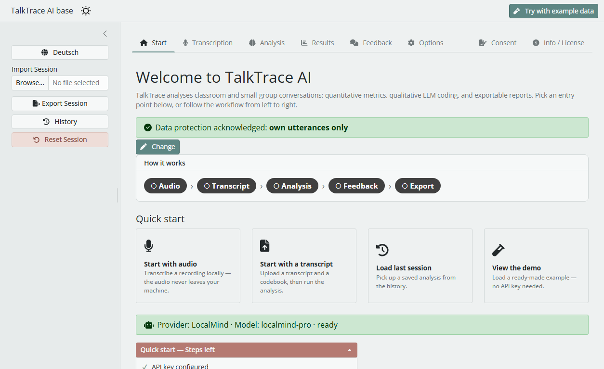

# TalkTrace AI base

[](https://pypi.org/project/talktrace-ai-base/)
[](https://pypi.org/project/talktrace-ai-base/)
[](LICENSE)

<p align="left">
    <picture>
        <source media="(prefers-color-scheme: light)" srcset="images/light.png">
        <source media="(prefers-color-scheme: dark)" srcset="images/light.png">
        
    </picture>
</p>

LLM-assisted analysis of classroom and small-group transcripts. Quantitative metrics, qualitative coding, structured reports — packaged as a desktop app, AGPL-3.0 licensed.

> **base** is the public distribution descended from the original [TalkTrace-AI](https://github.com/talktrace-ai/talktrace-ai) by Jami Schorling and Dennis Hauk (Leipzig University). base focuses on the stable, well-tested core; experimental features and the active research roadmap live in a private internal research version.

**Highlights** — Big-Four LLM backends (OpenAI, Anthropic, Mistral, DeepSeek) · Local audio transcription with in-app waveform trim (optional noScribe engine, 100% on-device) · Research-grounded formative teacher feedback (editable, DOCX/PDF) · GDPR Art. 13 consent-declaration generator (DOCX/PDF) · Streaming coding view · Human-in-the-loop code editing · Code-transition heatmap and over-time views · Auto-generated methods paragraph + reproducibility fingerprint · DOCX / PDF / XLSX / HTML / CSV exports · Light/Dark themes · EN/DE UI

**Full feature list** — [FEATURES.md](FEATURES.md)

---

## About

A FLOSS, platform-independent web app for analysing verbal interaction in classroom and small-group settings. Built on [Shiny for Python](https://shiny.posit.co/py/), it leverages LLMs to produce both **quantitative** metrics (participation, conversation shares) and **qualitative** coding (speech acts), and exports them as structured reports.

**Backends:** [OpenAI](https://platform.openai.com/) · [Anthropic](https://www.anthropic.com/api) · [Mistral](https://mistral.ai/) · [DeepSeek](https://platform.deepseek.com/)

---

## Download (Windows, no Python needed)

Grab the latest **TalkTraceAI-base-v1.0.0-win64.zip** from [GitHub Releases](https://github.com/MoominVibeCoder/talktrace-ai-base/releases), unzip, and double-click `TalkTraceAI.exe`. No Python installation required.

> For macOS / Linux or if you prefer running from source, see the Quickstart below.

---

## Quickstart (from source)

**Python ≥ 3.12 required** (development target: 3.13). On Python 3.14, the embedded desktop window is unavailable — `pywebview` is skipped and the app opens in your default browser instead. Then pick your OS:

<details>
<summary><strong>Windows</strong></summary>

Double-click `start.bat`, or from a terminal:

```bat
start.bat
```

Python install: download from [python.org](https://www.python.org/downloads/windows/) and ensure *"Add python.exe to PATH"* is enabled — otherwise `start.bat` cannot locate the interpreter.

</details>

<details>
<summary><strong>macOS</strong></summary>

```bash
chmod +x start.sh
./start.sh
```

Python install: the Python shipped with macOS is typically outdated. Install a current version from [python.org](https://www.python.org/downloads/macos/) or via Homebrew (`brew install python@3.13`).

</details>

<details>
<summary><strong>Linux</strong></summary>

```bash
chmod +x start.sh
./start.sh
```

`start.sh` detects missing `python3-venv` / `python3-pip` and offers to install them via `apt` / `dnf` / `pacman`.

For a native desktop window (otherwise opens in your default browser):

```bash
sudo apt install gir1.2-webkit2-4.1 python3-gi    # Debian/Ubuntu
```

**Limitations:**
- PDF export unavailable on Linux (relies on Microsoft Word) — use DOCX instead.
- Without a system keyring, API keys live only for the running session. Either start a keyring daemon, or rely on the bundled `keyrings.alt` file fallback.

</details>

<details>
<summary><strong>Launcher flags & development mode</strong></summary>

| Flag (Unix) | Flag (Windows) | Effect |
|---|---|---|
| `--reinstall` | `/reinstall` | Recreate the virtual environment from scratch |
| `--nowindow` | `/nowindow` | Start headless — open at <http://localhost:8000> |
| `--setup-only` | — | Provision the venv + dependencies, then exit |

For active development, use `dev.bat` (Windows) or `./dev.sh` (Linux/macOS) — runs the app under `shiny run --reload`, auto-restarting on `.py` saves.

</details>

---

## Interface

A **Start** tab is the landing page (workflow overview, entry tiles, current-configuration line, data-protection acknowledgment, quick-start checklist). The workflow then runs left to right — **Transcription · Analysis · Results · Feedback** — with **Options** alongside and **Consent** + **Info** on the right. LLM configuration (provider, model, switches, live cost estimate, *Analyze*) lives in the **Analysis** tab; the sidebar is organisation only — EN/DE switch and session save/restore/reset. The dark-mode toggle sits in the title bar.

<details>
<summary><strong>Start tab</strong> (landing page)</summary>

The first screen on launch. A workflow strip (Audio → Transcript → Analysis → Feedback → Export) shows how far you are; entry tiles jump to transcription, analysis, the session history, or a no-key demo. A configuration line reports the active provider/model, and a one-time **data-protection acknowledgment** (pick *consent* or *fictive test data*) gates LLM calls until confirmed.

</details>

<details>
<summary><strong>Analysis tab</strong></summary>

Document Input panel:
- **Transcript** *(required)* — must follow the [noScribe](https://github.com/kaixxx/noScribe) format. The interactive multi-stage converter handles transcripts from other tools (e.g. [aTrain](https://github.com/JuergenFleiss/aTrain)) — speaker-label detection, timestamp stripping, bracket-annotation review, per-speaker mapping, side-by-side preview.
- **Codebook** *(required for qualitative analysis)* — see the [example codebook](images/Example%20Codebook.docx). Codes apply to **all speakers** (teacher and students).
- **Teacher name** *(optional)* — if present in the transcript, enables teacher-specific metrics.
- **Group identifier and metadata** — used for report labelling.

Configure the LLM and click *Analyze* in the tab's **LLM configuration** card; the app switches to Results on completion.

> **Cost estimate.** The figure in the LLM-configuration card is a *lower bound* — transcript+codebook length × input price × ~4 for output. A cumulative cost tracker (in *Options*) sums spend across all your analyses.

</details>

<details>
<summary><strong>Transcription tab</strong> (optional, local)</summary>

Turn an audio recording into a transcript **entirely on your machine** — the audio never leaves your computer. Powered by the standalone open-source engine [noScribe](https://github.com/kaixxx/noScribe) (Whisper + pyannote), GPL-3.0, invoked only as a separate subprocess and installed on demand (~3 GB, one time, Windows).

Exposes the full set of noScribe options: audio in, output filename, start/stop range, language, **model (fast / precise)**, speaker count (pre-filled from the group size), mark-pause, overlapping speech, disfluencies, timestamps. An **in-app waveform editor** lets you drag handles for start and end of the segment — no external tool needed. A live progress display (step, percentage, elapsed time) shows what's happening, and an **editable transcript field** lets you fix speaker labels or spelling before the result is handed straight into the Analysis tab or saved as a `.txt` file.

Best suited to **10–15 minute small-group recordings** (CPU transcription ≈ 1.5× realtime with the *fast* model). See the in-app Info / License tab and [NOTICE](NOTICE) for the licensing and privacy details.

</details>

<details>
<summary><strong>Feedback tab</strong> (optional, LLM)</summary>

Generate **research-grounded, formative feedback for the teacher** after an analysis has run. The Feedback tab takes the coded turns, the codebook definitions, and the quantitative metrics from the same session and produces a structured prose report along three axes — **Stärken** (strengths) · **Entwicklungsfelder** (growth areas) · **Konkrete Umsetzungshinweise** (concrete suggestions) — with a short reference list grounded in dialogic-teaching literature (T-SEDA, IRE/IRF, accountable talk, productive disciplinary engagement).

The generated text is **fully editable** in-place — you can tighten, rephrase, or strip sections before exporting to **Word (.docx)** or **PDF**. A live cost estimate and the cumulative cost tracker (in *Options*) apply here too.

It is an **aid, not a verdict** — clearly framed as formative scaffolding for self-reflection, not summative assessment.

</details>

<details>
<summary><strong>Consent tab</strong> (optional)</summary>

Generate a print-ready **GDPR Art. 13** consent declaration for the training context — where a trainer team works *with* teachers and each teacher consents to processing their **own** recording. A pre-filled form (left) renders a live document preview (right) that you export to **Word (.docx)** or **PDF**.

The declaration reflects the real data flow: local transcription (audio stays on device) vs. the configured LLM as recipient. A cloud/local toggle drives the **third-country transfer** paragraph and a separate consent checkbox; missing mandatory fields surface as red `!!! … !!!` markers. The wording is adapted from the **CC0**-licensed [Consent-Gen-RDMO](https://github.com/berndzey/Consent-Gen-RDMO) (TU Dortmund).

It is an **aid, not legal advice** — the disclaimer is shown in the form and the document footer; have it reviewed by your data protection officer before use. See [NOTICE](NOTICE).

</details>

<details>
<summary><strong>Results tab</strong></summary>

Split into quantitative and qualitative sections.

**Quantitative** (deterministic): participation metrics, conversation shares (absolute + relative), per-speaker turn stats (count / mean / median), three-segment over-time view.

**Qualitative** (LLM-coded): per-speaker coding (every turn carries a `Sprecher` label), code distribution plot, coded-impulse table, over-time code distribution, **Markov-style code-transition heatmap**, and an **auto-generated methods paragraph** for paper manuscripts (copy-to-clipboard, EN/DE).

</details>

<details>
<summary><strong>Options tab</strong></summary>

- **API configuration** — keys for OpenAI, Anthropic, Mistral, DeepSeek. Keys live in the OS keyring (Keychain / Credential Manager / SecretService).
- **Models for LLM Selection** — edit the registry (add/remove models, set per-million-token prices); changes propagate to the Analysis-tab model picker in real time.
- **Custom Prompts** — modify the system + user prompts used for qualitative coding; defaults restorable any time.
- **Cost tracker** — cumulative spend across all analyses, per provider.
- **Test the app** (gold-standard self-test) — runs a known fixture and shows expected vs. actual to build trust before you analyse real data.
- **Additional Options** — defaults for teacher name, group ID, class size, advanced toggles like streaming.

</details>

---

## Privacy

TalkTrace AI does **not** store transcripts or analysis results on any external server controlled by the maintainers. All data required for an analysis are held in browser/local memory while you interact with the tool.

Because LLM models are not hosted by the app, the backend communicates with external LLM providers during the qualitative coding step. The relevant transcript and codebook excerpts are transmitted via the provider's API — any server-side storage or logging then depends on that provider's policies and your account settings.

**Audio transcription is fully local.** The optional Transcription tab runs the noScribe engine on your own machine — the audio file is never uploaded to any maintainer-controlled or third-party server. This makes it a privacy-preserving alternative to cloud transcription services. See [NOTICE](NOTICE) for the third-party engine/model details and licensing boundary.

Sessions can be saved/restored locally as `.pkl` files; reports can be downloaded. **API keys** live in the OS encrypted credential vault — Keychain (macOS), Credential Manager (Windows), SecretService (GNOME Keyring, KWallet) on Linux.

---

## Credits

TalkTrace AI base is maintained by [Simon Filler](https://orcid.org/0009-0008-8736-8831) at [TU Dortmund University](https://idif.sowi.tu-dortmund.de/institut/).

The original TalkTrace AI was developed by [Jami Schorling](https://orcid.org/0009-0005-9007-2896) and [Dennis Hauk](https://orcid.org/0000-0002-5779-2876) at the [Chair for Research on Teaching and Learning in Civic Education](https://www.sozphil.uni-leipzig.de/institut-fuer-politikwissenschaft/arbeitsbereiche/professur-fuer-fachdidaktik-gemeinschaftskunde/team/prof-dr-dennis-hauk), Leipzig University.

See [NOTICE](NOTICE) for full attribution.

## Contributing

Contributions are welcome — please read [CONTRIBUTING.md](CONTRIBUTING.md) and [CODE_OF_CONDUCT.md](CODE_OF_CONDUCT.md) before opening a pull request. Security issues: see [SECURITY.md](SECURITY.md).

## License

GNU Affero General Public License v3.0 — see [LICENSE](LICENSE) and [NOTICE](NOTICE).

The upstream [TalkTrace-AI](https://github.com/talktrace-ai/talktrace-ai) repository carries a CC BY-NC 4.0 notice. The base distribution is released under AGPL-3.0 with the explicit consent of the original authors (Schorling, Hauk); see [NOTICE](NOTICE) for the relicensing history.
